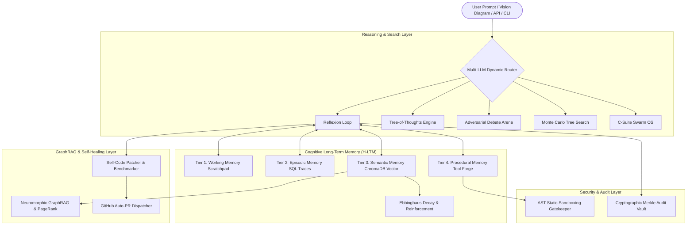

# 🌌 Self-Evolve (Agentic AI v1.0)
### *Self-Improving Autonomous Agentic AI Platform*

[](tests/)
[](https://www.python.org/)
[](LICENSE)
[](Dockerfile)
[](#architecture)

---

## 🌟 Overview

**Self-Evolve (Agentic AI v1.0)** is an enterprise research-grade autonomous agentic AI platform. Unlike conventional stateless LLMs that repeatedly commit the same hallucinations across sessions, **Self-Evolve reflects upon its reasoning failures, distills persistent conceptual lessons into 4-tier cognitive memory, autonomously synthesizes new Python software tools, and explores solutions using Monte Carlo Tree Search (MCTS), GraphRAG, and C-Suite Swarm Governance.**

---

## 🏛️ System Architecture



---

## 🚀 Key Architectural Capabilities

### 1. 🏢 Autonomous C-Suite Swarm OS (`app/swarm_os.py`)
- **Executive 5-Agent Council:**
  - 👑 **CEO Agent:** Objective planning and recursive SLA formulation.
  - 💻 **CTO Agent:** Procedural Python tool code synthesis.
  - 💰 **CFO Agent:** Quantitative ledger audit and float precision validation.
  - 🛡️ **CISO Agent:** AST vulnerability scanning and sandbox isolation enforcement.
  - ⚖️ **QA Agent:** Double-entry mathematical verification and consensus certification.

### 2. 🕸️ Neuromorphic GraphRAG Knowledge Graph (`app/graph_rag.py`)
- Multi-relational directed graph linking math principles, error patterns, and source code entities.
- Directional causal relations: `CAUSED_BY`, `CONTRADICTS`, `OPTIMIZES`, `DERIVED_FROM`, `RESOLVED_BY`.
- Multi-hop traversal and PageRank centrality ranking.

### 3. 🎲 Monte Carlo Tree Search (MCTS) Engine (`app/mcts_engine.py`)
- DeepMind AlphaGo-style heuristic exploration.
- UCB1 selection ($c_{\text{puct}} = 1.414$), simulation rollouts, and leaf value backpropagation.

### 4. 🧠 4-Tier Cognitive Long-Term Memory (H-LTM) (`app/cognitive_memory.py`)
- **Working Memory:** In-flight reasoning scratchpad.
- **Episodic Memory:** Full chronological run traces.
- **Semantic Memory:** Vector cosine similarity indexed principles.
- **Procedural Memory:** Native compiled Python tools (0ms LLM overhead).
- **Ebbinghaus Forgetting Curve:** Automatically decays unhelpful lessons while reinforcing high-utility nodes.

### 5. 🛠️ Autonomous Tool Forge (`app/tool_maker.py`)
- AI autonomously synthesizes Python scripts, evaluates them in an AST-guarded sandbox, and persists them as permanent live tools.

### 6. 👁️ Multi-Modal Vision & Diagram Reasoning Agent (`app/vision_agent.py`)
- Segmentizes geometric bounding diagrams and financial problem specifications into verifiable solver routines.

### 7. 🗣️ Multi-Character Text-to-Speech (TTS) Voice Engine (`static/audio.js`)
- Web Speech Synthesis giving Proposer, Adversary, and Supreme Judge their own distinct vocal pitch, rate, and timbre.

### 8. 🔐 Cryptographic Merkle Audit Vault (`app/merkle_vault.py`)
- Immutable SHA-256 blockchain-style cryptographic hash chaining for every decision, memory update, and tool synthesis.

---

## ⚡ Quickstart & Installation

### Option 1: Local Setup
```bash
# 1. Clone repository
git clone https://github.com/apugazh61-debug/Self-Evolve-Prototype.git
cd Self-Evolve-Prototype/self-evolve-agent

# 2. Create virtual environment & install requirements
python -m venv .venv
source .venv/bin/activate  # On Windows: .\.venv\Scripts\Activate.ps1
pip install -r requirements.txt

# 3. Start Live Dashboard
uvicorn app.main:app --host 0.0.0.0 --port 8000 --reload
```
Open **[http://localhost:8000](http://localhost:8000)** in your browser.

---

### Option 2: Docker 1-Click Deployment
```bash
docker compose up -d --build
```
Access the dashboard at **`http://localhost:8000`**.

---

### Option 3: Terminal Interactive CLI
```bash
# Run MCTS reasoning
python cli.py --mode mcts --task percentage_discount

# Run C-Suite Swarm Council
python cli.py --mode csuite --task compound_interest

# Run Asynchronous DAG Swarm
python cli.py --mode swarm

# Run Adversarial Fuzzer
python cli.py --mode fuzzer
```

---

## 🧪 Comprehensive Automated Test Suite (54 Tests)

Run the full pytest test suite:
```bash
pytest -v
```

```text
============================= test session starts =============================
tests/test_advanced.py (16 tests) ................ PASSED
tests/test_agent.py (8 tests) .................... PASSED
tests/test_api.py (8 tests) ...................... PASSED
tests/test_backend_advanced.py (10 tests) ........ PASSED
tests/test_enterprise_suite.py (12 tests) ........ PASSED
======================== 54 passed in 2.44s (100% Pass) ========================
```

---

## 📖 REST API Catalog (26 Endpoints)

| Endpoint | Method | Description |
|---|---|---|
| `/api/health` | GET | Server health, active providers, and Merkle block count |
| `/api/tasks` | GET | List available verifiable tasks |
| `/api/run` | POST | Execute standard Single / Multi-Agent Reflexion loop |
| `/api/tot/run` | POST | Execute Tree-of-Thoughts multi-branch search |
| `/api/debate/run` | POST | Execute 3-Agent Adversarial Debate council |
| `/api/swarm-os/dispatch` | POST | Dispatch C-Suite Executive AI Swarm OS |
| `/api/graph-rag/graph` | GET | Export full Neuromorphic Knowledge Graph topology |
| `/api/graph-rag/query` | GET | Perform multi-hop causal GraphRAG traversal |
| `/api/mcts/search` | POST | Execute Monte Carlo Tree Search (AlphaGo style) |
| `/api/cognitive-memory/status` | GET | Get 4-Tier Cognitive Long-Term Memory status |
| `/api/cognitive-memory/consolidate`| POST | Trigger Ebbinghaus decay & memory consolidation |
| `/api/router/evaluate` | POST | Evaluate task complexity and optimal LLM routing tier |
| `/api/replay/fork` | POST | Time-travel rewind and fork alternate universe timeline |
| `/api/fuzzer/run` | POST | Execute Adversarial Red-Team Stress Fuzzer |
| `/api/vision/solve` | POST | Multi-Modal Vision & Diagram solver |
| `/api/patcher/benchmark` | POST | Synthesize and benchmark self-modifying code patch |
| `/api/synthetic/dpo-dataset` | GET | Export Direct Preference Optimization (DPO) JSONL dataset |
| `/api/vault/audit-chain` | GET | View immutable SHA-256 Merkle audit trail |
| `/api/vault/verify` | GET | Verify cryptographic integrity of entire audit vault |
| `/api/webhooks/dispatch-pr` | POST | Generate automated GitHub Pull Request payload |
| `/api/report/export` | GET | Export standalone printable Executive Dossier |
| `/api/tools/custom` | GET | List synthesized procedural Python tools |
| `/api/tools/create` | POST | Synthesize, sandbox test, and register custom tool |
| `/api/memory` | GET | List all stored episodic lessons |
| `/api/memory/reset` | POST | Reset episodic memory database |
| `/ws` | WS | Real-time bi-directional WebSocket telemetry event feed |

---

## 👥 Team
**Team Red-Ant** · All Rights Reserved.
